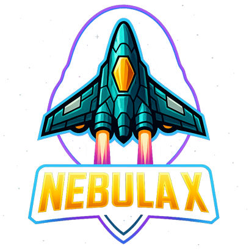

#  NEBULA X

A fast-paced retro arcade space shooter with modern graphics, built with React and HTML5 Canvas.

<div align="center">



### [ **PLAY NOW**](https://colinnebula.github.io/nebula-x/)

[](LICENSE)
[](https://reactjs.org/)
[](#-build-optimization)

</div>

---

##  Quick Start

### Play Online
Visit **[https://colinnebula.github.io/nebula-x/](https://colinnebula.github.io/nebula-x/)** to play instantly in your browser!

### Run Locally
```bash
npm install
npm start
```
Game launches at `http://localhost:5173`

---

## 🛠️ Microsoft Tools Integration

Nebula X uses **6 Microsoft technologies** for a professional, production-ready experience:

| Tool | Status | Purpose | Documentation |
|------|--------|---------|---------------|
| 🚀 **Azure Static Web Apps** | ⚠️ Setup Recommended | Superior hosting, global CDN, auto CI/CD, serverless APIs | [AZURE_STATIC_WEB_APPS_GUIDE.md](AZURE_STATIC_WEB_APPS_GUIDE.md) |
| 🎮 **PlayFab (Azure)** | ⚠️ Setup Required | Global leaderboards, cloud saves, achievements | [PLAYFAB_SETUP.md](PLAYFAB_SETUP.md) |
| 📱 **PWABuilder** | ✅ Active | Install to desktop/mobile, offline play | Built-in |
| 💙 **TypeScript** | ✅ Active | Type safety, 250+ definitions, autocomplete | [TYPESCRIPT_APPINSIGHTS_GUIDE.md](TYPESCRIPT_APPINSIGHTS_GUIDE.md) |
| 📊 **Application Insights** | ⚠️ Setup Required | Real-time analytics, error tracking, metrics | [TYPESCRIPT_APPINSIGHTS_GUIDE.md](TYPESCRIPT_APPINSIGHTS_GUIDE.md) |
| 🔧 **Edge DevTools** | ✅ Ready | 3D Canvas, performance profiling, debugging | [EDGE_DEVTOOLS_GUIDE.md](EDGE_DEVTOOLS_GUIDE.md) |

**See [MICROSOFT_TOOLS_SUMMARY.md](MICROSOFT_TOOLS_SUMMARY.md) for complete integration guide**

**Azure Static Web Apps:** 3x faster than GitHub Pages with global CDN, free SSL, auto CI/CD, and serverless APIs!  
**Cost:** All FREE for indie games! 💰

---

## 🎮 Features

### 🏆 Global Leaderboards (PlayFab)
Compete with players worldwide! Nebula X integrates with **Microsoft Azure PlayFab** for:
- **Real-time leaderboards** - See global high score rankings
- **Cloud saves** - Progress syncs across all your devices
- **Achievements tracking** - Unlock and sync achievements
- **Player analytics** - Track your stats and improvement
- **Cross-device play** - Start on PC, continue on mobile

**Setup (2 minutes):**
1. Get free Title ID from [PlayFab](https://developer.playfab.com/)
2. Create `.env` file: `REACT_APP_PLAYFAB_TITLE_ID=YOUR_ID`
3. See [PLAYFAB_SETUP.md](PLAYFAB_SETUP.md) for detailed guide

### 📱 Progressive Web App (PWA)
Install Nebula X like a native app:
- **Offline play** - Game works without internet
- **Faster loading** - Assets cached locally
- **Full-screen mode** - Immersive gaming experience
- **Desktop/mobile install** - Add to home screen or Start Menu

**Auto-prompts to install when you visit the game!**

### 🎯 Game Modes
- **Campaign** - 50 waves of increasing difficulty
- **Survival** - Endless mode, how long can you last?
- **Boss Rush** - Fight all bosses back-to-back
- **Time Attack** - Race against the clock
- **Practice Mode** - Train on specific waves

### 💥 Core Gameplay
- Intense bullet-hell patterns
- Multiple weapon types and powerups
- Epic boss battles every 5 waves
- Achievements and rank system
- Gamepad support (PS4/PS5/Xbox)
- Touch controls for mobile

### 💙 TypeScript Support
Built with **TypeScript** for type safety and better developer experience:
- **250+ type definitions** - Full game entity types
- **Better IDE support** - IntelliSense autocomplete everywhere
- **Catch bugs early** - Type checking at development time
- **Self-documenting** - Types serve as documentation
- **Gradual migration** - Mix JS and TS files

**See [TYPESCRIPT_APPINSIGHTS_GUIDE.md](TYPESCRIPT_APPINSIGHTS_GUIDE.md) for migration guide**

### 📊 Real-Time Analytics (Application Insights)
Monitor your game with **Azure Application Insights**:
- **Real-time metrics** - Player count, FPS, performance
- **Error tracking** - Automatic exception reporting with stack traces
- **Custom analytics** - Track kills, bosses, achievements
- **Performance monitoring** - FPS, load times, bottlenecks
- **User behavior** - Session duration, retention, engagement

**Setup (2 minutes):**
1. Create [Application Insights](https://portal.azure.com/) resource (FREE)
2. Add to `.env`: `REACT_APP_APPINSIGHTS_KEY=your-key`
3. See [TYPESCRIPT_APPINSIGHTS_GUIDE.md](TYPESCRIPT_APPINSIGHTS_GUIDE.md) for full guide

### 🔧 Development Tools (Edge DevTools)
Optimize and debug with **Microsoft Edge DevTools**:
- **3D Canvas inspection** - Visualize layers, check GPU acceleration
- **Performance profiling** - Find FPS drops, identify bottlenecks
- **Memory leak detection** - Fix slowdowns over time
- **Network throttling** - Test mobile loading performance

**See [EDGE_DEVTOOLS_GUIDE.md](EDGE_DEVTOOLS_GUIDE.md) for detailed debugging workflows**

---

##  Support Development

Enjoying Nebula X? Support continued development and new features!

<div align="center">

[](https://paypal.me/YourPayPalUsername)
[](https://ko-fi.com/YourKofiUsername)
[](https://github.com/sponsors/ColinNebula)

</div>

Your support helps:
-  Add new game modes and features
-  Create original music and sound effects  
-  Fix bugs and improve performance
-  Add mobile support
-  Keep the game free and open source

Even a small donation makes a huge difference! 
